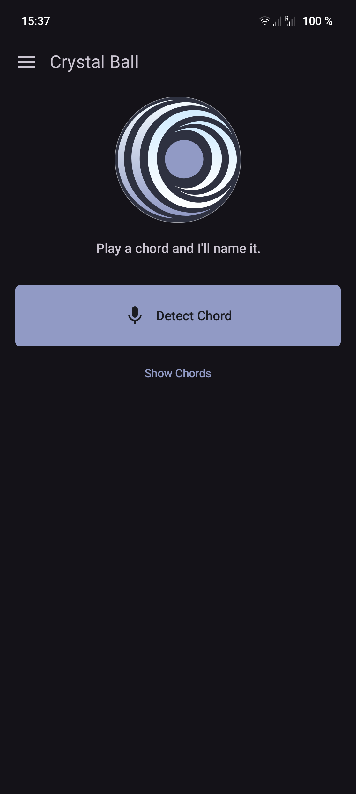

<h1>
  
  Crystal Ball
</h1>

An Android tool that listens to your guitar and tells you what chord you just played. Press **Detect Chord**, strum, and it names the chord and draws how to fret it — with the chords it nearly picked instead one tap away, and other ways to play the same one further up the neck. Set a capo and the shapes follow your hands.

Early-stage release — expect rough edges. Feedback and bug reports welcome via Issues.

## Screenshots



## Features

- **Detect a chord by ear** — press, strum, done. It listens until the answer settles rather than for a fixed time, so a clean open chord resolves in about a third of a second; strumming again restarts it, so a bad take needs no second press.
- **Ranked alternatives** — the best fit is a guess, not ground truth, so the runner-ups sit under it and one tap swaps the page over to any of them.
- **Chord shapes, not just names** — the most idiomatic grip drawn large, plus other voicings walking up the neck. Open shapes are the ones a player expects to see, by name.
- **Capo-aware** — detection is unaffected (the microphone hears the real chord either way), but the shapes are redrawn behind the capo, fret numbers stay as printed on your neck, and anything the capo pushes off the end is dropped rather than offered.
- **Chord dictionary** — *Show chords* looks any chord in the vocabulary up by hand, without playing a note.
- **Session comforts** — System/Light/Dark themes, keep-screen-on with a quiet notice that it is on, and an in-app quick help sheet. Preferences persist across launches.

## How it works

A strum is found by measuring the room's noise floor rather than by a fixed threshold — no absolute level suits both a mic'd amp and an unplugged hollow-body across the room. The pick attack is skipped (a broadband click carries no pitch), and chroma evidence accumulates from the frames after it until the ranking settles.

Under that:

1. **STFT → chromagram.** A Hann-windowed 8192-point FFT every 2048 samples, folded into 12 pitch-class bins over 65–2000 Hz, normalised per frame so playing volume does not matter.
2. **Harmonic template matching.** 12 roots × 7 qualities = 84 templates, each modelling the overtone series a real chord deposits rather than a bare note mask, scored by Pearson correlation. Triads carry a small prior over sevenths and sus chords, which share most of their notes.
3. **Bass evidence.** A second chroma fold weighted by 1/f², so it reports the *lowest* note rather than a low-register average. This is what separates chords that are otherwise identical: Csus2 and Gsus4 are the same three pitch classes, and only the bass note says which one you played.

Honest about accuracy: template matching on clean triads is good, and degrades on a boomy room, a badly tuned guitar, or a phone held across the room. It is a practice aid, not ground truth — hence the runner-up row, which is one tap from correcting it.

**Vocabulary:** `maj`, `min`, `dom7`, `maj7`, `min7`, `sus2`, `sus4`, across all 12 roots. Denser extensions (6ths, 9ths, altered dominants) are deliberately out of scope: their templates overlap the above too heavily to survive single-microphone matching, and adding them mostly degrades the chords people actually play.

**Shapes:** standard tuning (EADGBE). A curated table of open-position grips, plus movable CAGED forms transposed up the neck to cover all 84 chords — including those with no open shape. Every shape, curated or generated, is verified by unit test to sound its chord's notes and nothing else, so a mistyped fret cannot ship.

## Tech stack

- **Language:** Kotlin (Java 17 target)
- **UI:** Jetpack Compose (Canvas for the chord diagrams)
- **Build:** Android Gradle Plugin 9.2.1 + Gradle 9.5.1 (via wrapper)
- **SDK:** `minSdk` 26 · `compile`/`targetSdk` 36
- **Capture:** `AudioRecord` on the plain microphone — the UNPROCESSED source is spectrally honest but ships with markedly lower gain, and a quiet instrument needs the level more than the purity
- **DSP:** custom (radix-2 FFT, chromagram, template matching), no native/NDK or GPL dependencies
- **Async:** Kotlin Coroutines + Flow

The FFT and the STFT front-end are adapted from [RubberRing](https://github.com/mkay/RubberRing)'s offline chord detector, reshaped for live audio.

## Building

Requires a JDK (17+) and the Android SDK. Point the build at your SDK by creating a `local.properties` file in the project root (this file is git-ignored):

```properties
sdk.dir=/path/to/Android/Sdk
```

Then build a debug APK:

```sh
./gradlew assembleDebug
```

The APK lands at `app/build/outputs/apk/debug/app-debug.apk`; sideload it to a device to run it.

The DSP and the shape tables are pure Kotlin, so the interesting parts are covered without a device:

```sh
./gradlew test
```

## Project layout

```
app/src/main/java/de/singular/crystalball/
  MainActivity.kt        Compose entry point, microphone permission, navigation
  DetectViewModel.kt     screen state, drives the listener
  Settings.kt            preferences + capo arithmetic
  audio/
    Fft.kt               radix-2 FFT (from RubberRing)
    Chromagram.kt        STFT -> 12-bin chroma + bass fold
    Chord.kt             root + quality, and the notes they imply
    ChordTemplates.kt    the 84 harmonic templates and their priors
    ChordRecognizer.kt   accumulates chroma, ranks candidates
    StrumGate.kt         adaptive noise floor: is the guitar sounding?
    ChordListener.kt     AudioRecord capture + auto-stop
  chords/
    Voicing.kt           a fingering, and what it sounds
    ChordLibrary.kt      curated open grips + generated CAGED forms
  ui/
    ChordDiagram.kt        the chord box (Canvas)
    DetectScreen.kt        detect / listening / result / browse panes
    CrystalDrawer.kt       the side panel
    ChordSettingsSheet.kt  capo + chord naming
    AppSettingsSheet.kt    theme + keep screen on
    QuickHelpSheet.kt      what it does, and what it won't
    Theme.kt               colours
```

## Roadmap

- Saving a chord to a collection / song.

## Support

If Crystal Ball is useful to you, you can support its development on [Ko-fi](https://ko-fi.com/s1ngular). Thank you!

## Disclaimer(s)

1. This app is built around my own playing, particularly the chords I use. Detection is a practice aid rather than ground truth: it hears seven chord qualities in standard tuning, and it will happily name the nearest one it knows for anything richer.

2. This project was developed with the assistance of Claude under my direction and functional review.
